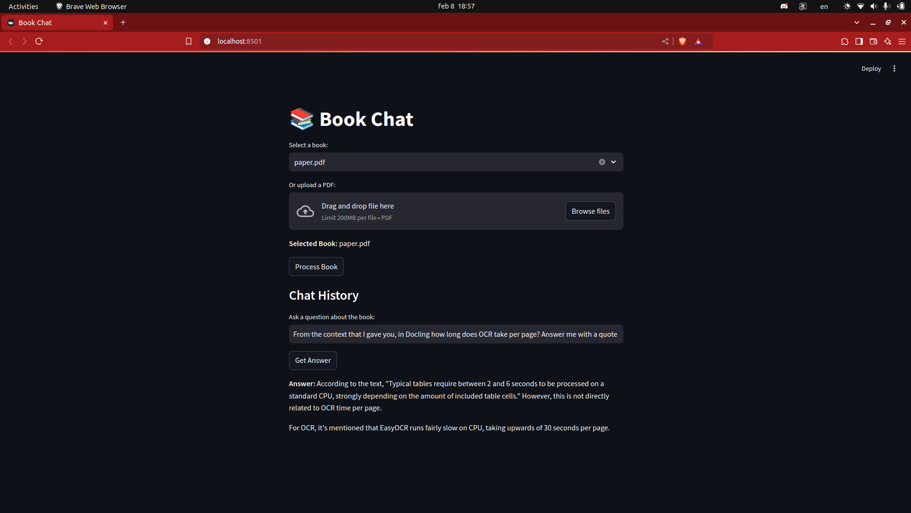

# Book-Chat
 

This app was created for the TSIS 2024-2025 course at University of Bucharest (Software Engineering masters).
This app uses Docling to process user uploaded pdf documents into a structured format (Markdown).
The processed documents are then fed into a LLM, for it to be able to take part into the app's QA system.

## Steps to run the app:
1. Install [LM Studio](https://lmstudio.ai/) and choose a LLM you like (we suggest using LLAMA)
2. Clone the repo using "git clone https://github.com/FrancescoP1/Book-Chat.git"
3. Open the project and run the following command in a terminal: "pip install -r requirements.txt"
4. After the requirements have been installed, run the following command inside the terminal: "streamlit run main.py"

## Contributors:
- Robert Liță
- Francesco Petrovici
- Melissa Vlad
- Mihai Bîrsan

## A small presentation

In order to view a presentation of our work, please check the [TSIS.PDF](resources/TSIS.pdf) file

 

